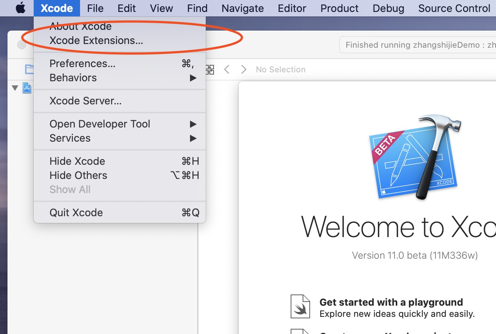
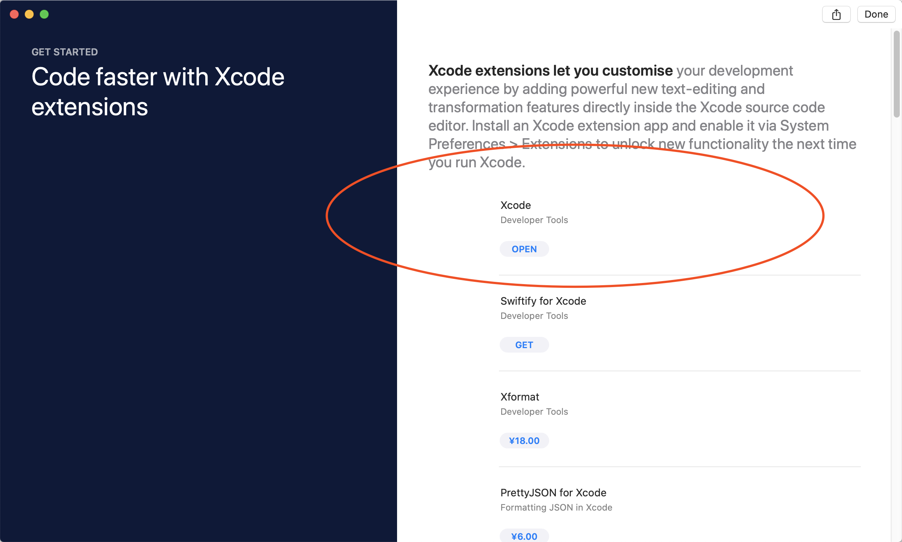
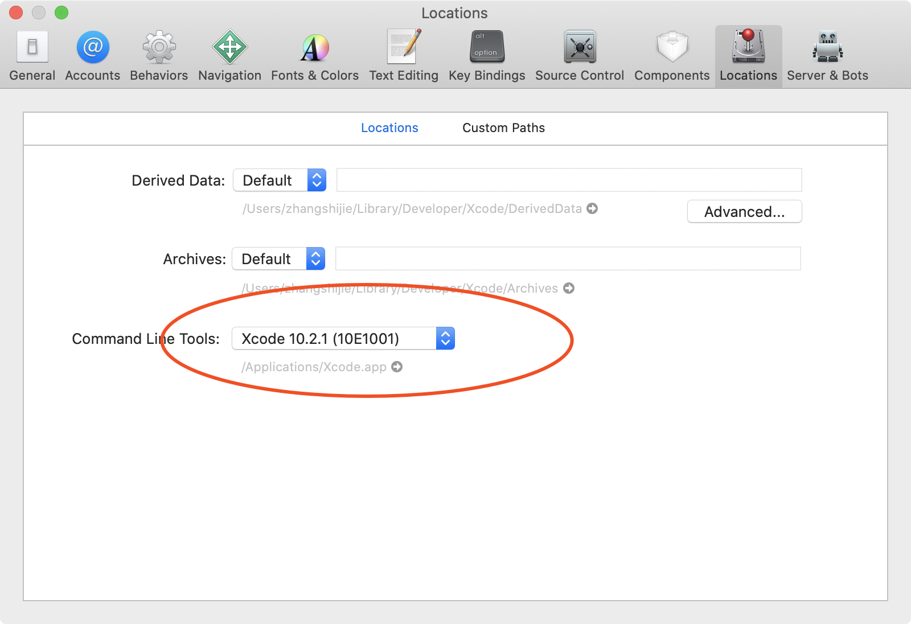

### Xcode 11 与 cmake 不兼容问题

> Xcode 11 与 cmake 暂时无法兼容

如果你和我一样，将系统升级到 mac OS 10.15 版本，并且本机上只有 Xcode 11 没有 Xcode 10 时，恭喜你，入坑了，截止至 2019/7/12，还无法通过 Xcode 11 中的 clang 成功编译 iOS 项目（可能有，但是我没找到方法）。目前唯一的解决方法就是重新现在 Xcode 10，采用 Xcode 10 中的 clang 才进行编译。由于最新的 mac OS 系统中，无法从 AppStore 中搜索到 Xcode 10，苹果将 Xcode 10 的下载移动到了 Xcode Extensions 中了。如图 1.1 和 图 1.2





下载 Xcode 10.2.1 后，在 Xcode -> Preferencs -> Locations 中 ，将 Command Line Tools 修改成 Xcode 10.2.1 就可以完成编译了，如图 1.3 所示：





### Python3 使用时 Xcode 11 和 Xcode 10 冲突

如果电脑中同时安装了 Xcode 11 和 Xcode 10，在使用 Python3 时，会报以下异常

```
python3: error: unable to find utility "python3", not a developer tool or in PATH

```

这时候，需要到 Xcode 中，将 Command Line Tools 设置成 Xcode 11，就可以解决上述问题。

