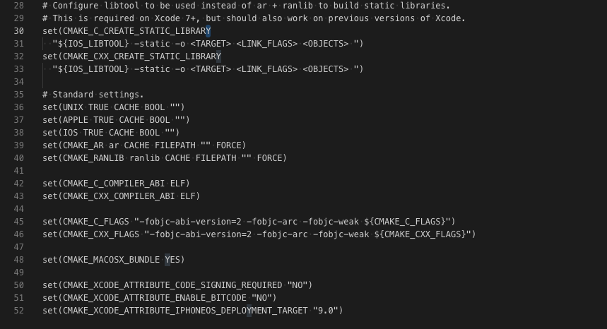

# 跨平台工程构建

## 前言

最近由于项目需求，需要采用 C++ 编译一个库，供给 iOS 和 android 使用。本人是第一次接触到跨平台项目，之前也几乎没有接触过相关的内容，因此刚开始的时候一脸懵逼。回顾整个过程，最困难的地方是在整个项目架子的搭建过程。为了方便自己后续的 C++ 库的开发，就花了点时间编写了一个简单的 python 脚本，可以较为简单、快速的搭建一个 C++ 跨平台工程的架子。

下面的内容，主要从 4 个方面进行介绍：

1. 环境配置
2. 项目脚手架脚本使用
3. 项目整体结构介绍
4. 实例演示

## 环境配置

由于本人是在 mac 上面进行编程，所以以下所有的内容都是以 mac osx 系统为基础进行的。相关的环境配置分成 2 部分。「项目脚手架运行环境配置 」和「跨平台项目编译环境配置」


### 项目脚手架运行环境配置 

- python 3

### 跨平台项目编译环境配置 

- python(>=2.7.11)
- cmake(3.8.x)
- conan(>=0.30.x) 添加内部仓库 conan remote add nuget_conan https://artifactory.gz.cvte.cn/artifactory/api/conan/conan-local --insert 
- NDK(android-ndk-r13b)
- 配置 ANDROID_NDK_HOME 环境变量指向 NDK 目录，编译 android 需要

> Tip
> [Xcode 11 与 cmake 不兼容问题](./坑.md)


## 项目脚手架脚本使用

1. 从 [GitLab](https://gitlab.gz.cvte.cn/zhangshijie/crossplatformcreator) 上拉取脚手架代码

> git clone git@gitlab.gz.cvte.cn:zhangshijie/crossplatformcreator.git 

2. 进入到 crossplatformcreator 文件夹

> cd crossplatformcreator 

3. 运行 createProject.py 脚本

> python3 createProject.py 

4. 按照脚本提示输入项目名称、项目路径、iOS 的 bundle ID 和安卓的包名，如下图所示：


如果一切顺利，就可以在指定的项目路径中找到新创建的跨平台项目。

> Tip
> [python3 使用时，Xcdoe 11 和 Xcode 10 冲突问题](./坑.md)


## 项目整体结构

项目的整体目录结构如下图：


按照文件的功能，可以目录归为 3 部分：
1. 脚本文件
2. 配置文件
3. 源文件

#### 脚本文件

`bootstrap.py` 和  `build.py` 属于脚本文件。


##### bootstrap.py
`bootstrap.py` 是对 CMake 命令行的封装，使用 `bootstrap.py`，可以快速的创建不同平台的项目。例如：调用 `python bootstrap iOS`，会在项目的根目录创建一个 `build` 文件夹，里面存放着一个 iOS 项目。如下图所示：


各个平台对应项目的创建方法，可以在项目根目录中的 `README.md` 进行了解


##### build.py
调用 `build.py` 时，会对各个平台的项目进行编译，编译的结果存储在各个平台根目录的 `lib` 的文件夹中。例如：调用 `python build.py iOS`，会编译出 `framwork`，存储在 `lib`中，编译结果如下图所示：


一般来说，脚本文件都是不需要修改的，所以直接使用就可以了。

#### 配置文件

`CMakeLists.txt`, `conanfile.txt`, `buildtool文件夹` 和 `cmake文件夹` 都是和 `cmake` 相关的配置文件。下面通过几个例子，来解析下各个配置项的作用。

#####  buildtool文件夹

`buildtool`，顾名思义,里面存储的是一些编译相关的工具文件或配置，默认该文件夹里面会有个 `conan.cmake` 文件，`conan` 是 C++ 中包管理工具，因此该文件主要功能是 `cmake` 在编译时，使用 `conan` 拉取依赖库。拉取的库存储在用户本地的`/Users/{用户名}/.conan/data`路径下（mac）。一般来说，不需要改动该文件。


##### cmake文件夹

由于不同平台需要用到的编译参数不一样，所以会将各个平台的参数，统一存储到`.camke`配置脚本中，然后在编译不同目标系统时，为 `cmake` 指定不同的编译配置脚本，我们可以打开项目根目录中的 `bootstarp.py` 文件，然后全局搜索 `args["system"] == "ios"`, 如下图所示


其中，从上往下第二个红框中拼接了`ios.toolchain.cmake`的路径，在第三和第四个红框的位置，将路径设置给了`DCMAKE_TOOLCHAIN_FILE`变量。进入到 `ios.toolchain.cmake` 文件中查看，我们主要可以看到以下 3 种语法

```
execute_process(...)
message(...)
set()
```

`execute_process` 的作用用是执行 `shell` 命令，在 `ios.toolchain.cmake` 中有以下代码


这段代码的功能主要是执行 `xcrun` 指令


`message` 的功能主要是输出信息到控制台

`set` 的功能主要是设置变量，在 `ios.toolchain.cmake` 中存在大量的变量设置，如下图所示



例如，对于 iOS 来说，`50`,`51`,`52` 3 行分别设置了项目的签名、bitcode 和 最低支持版本 3 个相关配置。


正常来说，这些配置都是通用配置，不用进行修改。

如果需要修改配置，但是又不清楚自己的平台使用了哪一个 `.cmake` 脚本进行配置，可以到 `bootstarp.py` 中找到目标平台，查看该平台的 `DCMAKE_TOOLCHAIN_FILE` 设置的路径。以 `andorid` 为例，如下图所示，


`android` 是通过系统环境变量`ANDROID_NDK_HOME`来获取到系统`NDK` 中的`.cmake`配置。


##### conanfile.txt 

由于我们是使用`conan`来进行包管理，`conanfile`中设置了项目中依赖到的第三方库，下面例子展示了如何引入一个 `boringssl` 库：

```
[requires]
boringssl/1.1.0@1602/stable
# 添加第三方依赖库，公司内部编译了常用的第三方库，可以通过 https://artifactory.gz.cvte.cn/artifactory/webapp/#/artifacts/browse/tree/General/conan 进行查找

[generators]
cmake_multi

[options]
boringssl:shared=False
#第三方依赖库的配置，shared=False 通过静态库的方式引入

```

##### CMakeLists.txt

`cmake` 是一个项目软件构建管理工具，它允许开发者用一种简单的文本格式进行构建参数的指定。前面我们讨论到的`camke`文件夹中的 `.cmake` 脚本主要是用于未编译时环境的配置，而正式编译时，由  `CMakeLists` 文件中的内容，设置了编译的源码路径，各个子模块源码直接的依赖关系，生成工程的类型等等。

具体的 `cmake` 语法在这里就不细讲了。一些项目的配置项，会在下面的源文件模块中提及到。

#### 源文件

项目根目录的`sdk`中存储的项目的源码文件，由于 `CMakeLists.txt` 和源码文件关联性较大，所以会合并在一起讲。

项目源文件目录初始目录结构如下:


```
- HelloWorld
  - sdk
    - src
      - CMakeLists.txt
      - Commons
      - header
      - src
      - jni 

    - cocoa
    - android
    
  - CMakeLists.txt

```

首先在根目录的 `sdk` 目录中，有 3 个子目录 `src`, `cocoa`, `android`，如下所示

```
- HelloWorld
  - sdk
    - src
    - cocoa
    - android
```

`src` 主要存放 C++ 相关的源码

`cocoa` 主要存放 Objective-C 对于 C++ 的封装源码

`android` 主要存放 Android 的 java 文件

也就是说，在 `src` 目录中存储了核心的源码信息，而在 `cocoa` 和 `android` 中主要存储的是根据不同的平台，对 C++ 封装的源码


详细看下 `src` 子目录中的内容，其内容如下：

```
- src
  - CMakeLists.txt
  - Commons
  - header
  - src
  - jni

```

在 `src` 目录中，有一个 CMakeLists 文件，说明该目录应该是一个子模块，这时候打开下根目录的 `CMakeLists.txt` 文件，直接拉到文件最下面，可以看到以下代码

```
# 编译 sdk/src 目录下文件，本质上是调用 sdk/src 目录中的 CMakeLists.txt
add_subdirectory(sdk/src)
```

在使用 `cmake` 编译时，`sdk/src`会作为一个子模块加入主项目中。


`Commons`是一个存储版本信息的文件，如果不需要版本控制，可以不需要理会。

`header` 存储的是 C++ 对外暴露的头文件

`src` 存储的是 C++ 的源文件，包含了 `.h` 和 `.cc` 文件

`jni` 存储的是 `android` 的 `jni` 层的源文件


了解目录的整体结构后，接下来需要简单了解下`CMakeLists`中的相关配置。


下面图片主要展示了 `CMakeLists` 中文件加载的代码


通过 `file` 指令加载目录中的指定类型的问题，并存储到变量中，如

```
file(GLOB objc_public_header "${CMAKE_SOURCE_DIR}/sdk/cocoa/src/*.h*")
```
上面的直接就是加载`{CMAKE_SOURCE_DIR}/sdk/cocoa/src/`中所有的 `.h` 文件，存储在 `objc_public_header` 变量中。

成功获取到源文件后，就需要将源文件编译生成库或项目，下图所示：


通过 `add_library`，可以生成一个静态库或动态库。如果是 iOS 需要引入 `cocoa` 目录中的封装代码和封装代码中使用到的系统基础库，如果是安卓，需要引入 `jni` 目录中的封装代码。`add_library` 中的第二参数是指定生成动态库或静态库，不设置默认是静态库，`SHARED` 是动态库。


如果项目中使用到了依赖库，那么还需要将依赖库和项目的`target`链接起来，如下图所示

> target 就是通过 add_library 或 add_executable 创建的内容


所以在 `cmake` 中，我们是使用 `conan` 来拉取依赖库，然后通过 `target_link_libraries` 将依赖库链接到指定的`target`中。


我们梳理下 `CMakeLists` 文件中整体的思路
1. 通过 `file` 获取到源文件的路径集合
2. 通过 `add_library` 将 `file` 获取到的源文件路径集合编译出一个`target`（库或可执行文件）
3. 通过 `target_link_libraries` 将编译出来的`target`和依赖库进行链接


## 实例演示
如果你是 iOS 或 Cocoa 的开发者，下面为你展示下在如何通过 Xcode 来进行库的编码和调试

1. 相互环境配置
2. 通过 crossplatformcreator 创建一个跨平台工程，helloWorld
3. 在项目根目录运行运行 python bootstrap.py ios，创建 iOS 工程
4. 打开 build 目录中的 iOS 工程，如下图


### 如何编写 C++ 源码

直接在`xxxStaticSDK`或`xxxSDK`中的 `header` 和 `src` 中直接编写源码就可以了，如下图所示，添加一个 `helloWorld` 方法


### 如何封装 C++ 源码
直接在`xxxStaticSDK`或`xxxSDK`中的 `Header Files` 和 `Source Files` 中直接编写封装源码，如下图所示，添加一个 `helloWorld` 方法


### 如何调试

在 `HelloWorldDemo` 中直接引入封装后的`Objective-C`对象，调用相应的方法。然后直接运行 `HelloWorldDemo` target 就可以进行调试。


